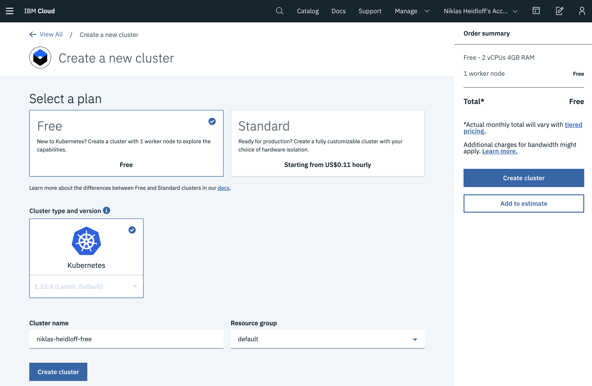
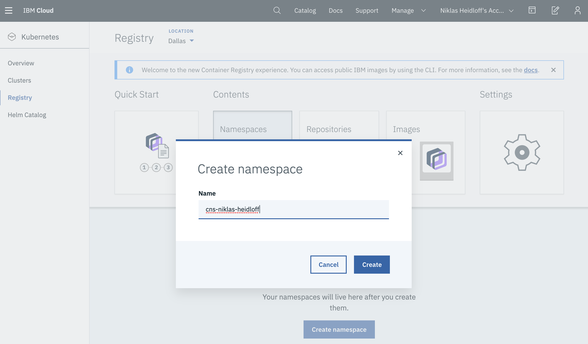
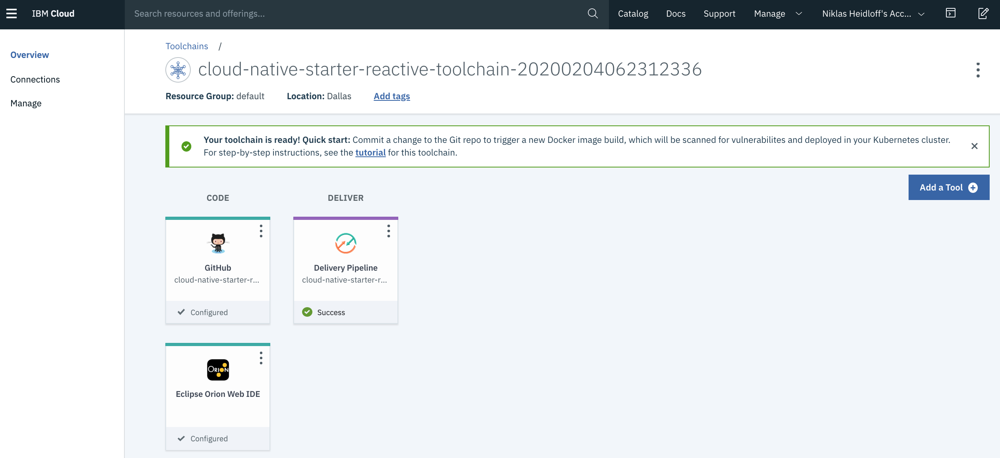
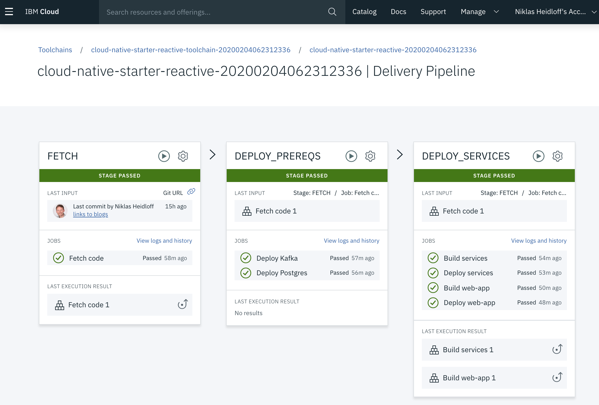
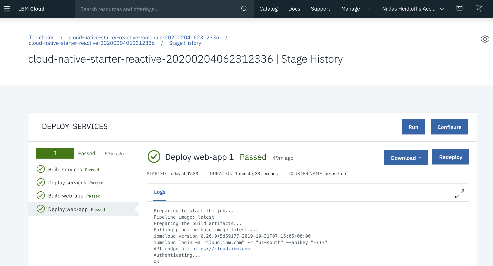
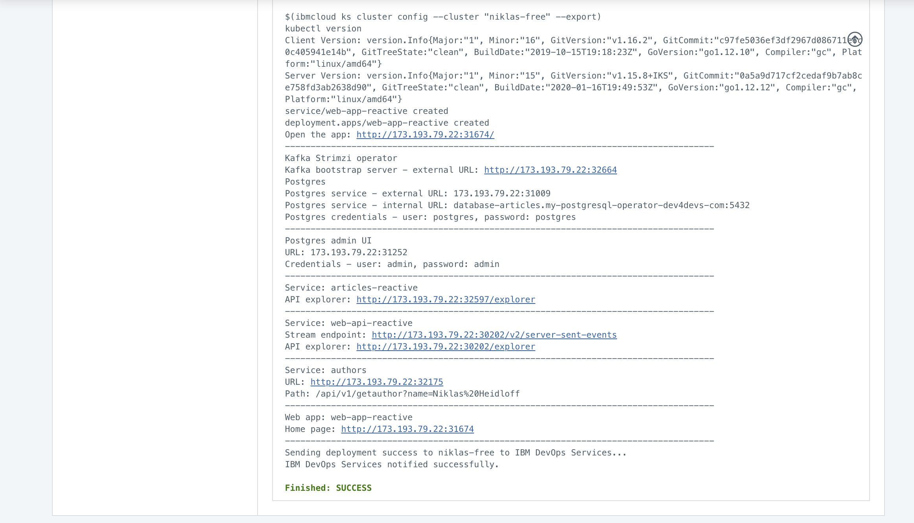

# Toolchain for 'Cloud Native Starter - Reactive'

This project contains a toolchain that is run on the IBM Cloud to deploy the complete sample application from [cloud-native-starter](https://github.com/IBM/cloud-native-starter/tree/master/reactive) on the IBM Cloud Kubernetes Service. Client side installations and configurations are not necessary.

The toolchain installs the following components:

* Postgres and admin client
* Kafka
* Microservices: articles, authors, web-api
* Web application
* Eclipse Orion web IDE

Before you can trigger the toolchain you need three prerequisites which are all free:

* [IBM id](#ibm-id)
* [IBM Cloud Kubernetes Service](#ibm-cloud-kubernetes-service)
* [IBM Container Registry](#ibm-container-registry)

### IBM id

First you need an IBM Cloud account. You can [register](http://ibm.biz/nheidloff) to get a free Lite account. Credit cards are not required and there are no time restrictions.

### IBM Cloud Kubernetes Service

Kubernetes lite clusters are free of charge, but they cannot be created with IBM Cloud Lite accounts. In order to create lite clusters, credit cards need to be entered (they won't be charged). Alternatively you can get feature codes at developer conferences or [contact](https://cloud-native-starter.mybluemix.net/about) us. 

Enter the feature code in your [IBM Cloud account](https://cloud.ibm.com/account/settings).

After this [create a free cluster](https://cloud.ibm.com/kubernetes/catalog/cluster/create). This process takes between 5 and 20 minutes.

<kbd></kbd>

### IBM Container Registry

With an IBM Cloud Lite account comes the IBM Container Registry with a 0.5 GB quota. Before the reactive sample application can be deployed, a namespace can be created. You can choose any name you like, but it needs to be unique (errors will be displayed, if not unique).

[Create a namespace](https://cloud.ibm.com/kubernetes/registry/main/namespaces) in the dashboard.

<kbd></kbd>

### Step 1

Next create the toolchain to deploy the sample application.

After clicking the button above, the following page will be opened. 

If this is your first time you use this functionality, you need to grant the toolchain access to your GitHub account. In this case click the 'Authorize' button:

<kbd></kbd>

Grant IBM-Cloud access:

<kbd></kbd>

After this the GitHub integration will be valid:

<kbd></kbd>

### Step 2

On the Delivery Pipeline tab create a new API key or refer to an existing one:

<kbd></kbd>

When creating a new key, simply click the 'OK' button:

<kbd></kbd>

### Step 3

After the key has been defined, your Kubernetes cluster will be displayed in the combobox:

<kbd></kbd>

After this click the 'Create' button in the upper right corner:

### Step 4

The pipeline will automatically be triggered:

<kbd></kbd>

Click on the Delivery Pipeline icon to see the deployment status:

<kbd></kbd>

After the pipeline has been run, you can open the log from the last job 'Deploy web-app' to see all URLs to use the sample application:

<kbd></kbd>

<kbd></kbd>
